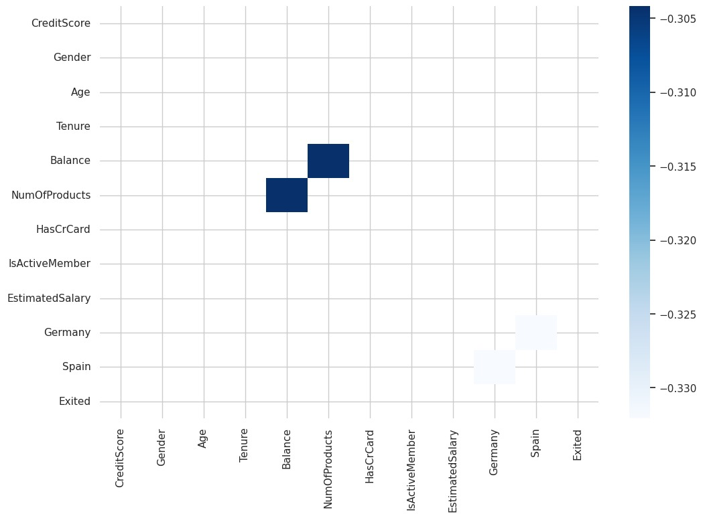
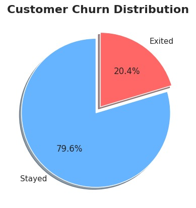
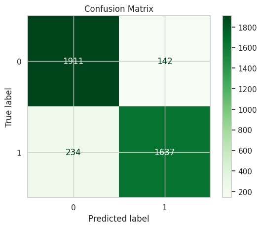

https://github.com/user-attachments/assets/f678bc2e-5ecb-4d39-afd5-35b548499531

## All important Links

#### Project Deployed Link : https://churn-prediction-roc-096-fvipcg2r5dvwsfea9tuqqz.streamlit.app/

#### Dataset Link : https://www.kaggle.com/datasets/shrutimechlearn/churn-modelling

# 🏦 Bank Customer Churn Prediction 
______________________________________

##  Project Overview

    Customer churn is one of the most critical problems in the banking sector.
    This project focuses on predicting whether a bank customer
    will leave the bank (churn) or not, using advanced Machine Learning techniques.
    and detailed exploratory data analysis.
    
    The goal is to identify churn-prone customers early, 
    so that banks can take preventive actions and improve customer retention.
    
##  Dataset Description

    Dataset Name: Churn Modelling Dataset

    Total Records: 10,000

    Total Features: 14 (before feature engineering)

    Target Variable: Exited

##  Target Variable

    Exited = 1 → Customer left the bank (Churned)
 
    Exited = 0 → Customer stayed with the bank
    
##  Exploratory Data Analysis (EDA)

Key insights discovered from EDA:

🔹 80% customers stay, 20% customers churn → Imbalanced dataset

🔹 60% customers are aged between 30–45

🔹 Customers with lower tenure & fewer products are more likely to churn

🔹 Germany-based customers show higher churn tendency

🔹 Older customers are more likely to exit

🔹 Customers with low engagement (inactive members) have higher churn risk

## ⚙️ Feature Engineering

- To improve predictive performance,
- multiple engineered features were created:

> Log & Sqrt Transformations
 
       Log_Balance
       Log_Age
       Sqrt_EstimatedSalary
       
> Interaction Features

    Balance_per_Product
    Age_Balance
    CreditScore_IsActive
    Tenure_NumOfProducts
    Age_Gender
    Non_France

These features helped capture hidden relationships in customer behavior.

##  Handling Imbalanced Data

 

> The dataset was highly imbalanced.
> To solve this:

        ADASYN (Adaptive Synthetic Sampling) was applied
        Generated synthetic samples for churned customers
        Resulted in balanced training data and improved recall.
        
##  Models Trained

> Multiple ML models were trained and compared:

| Model                     | Accuracy |
|---------------------------|----------|
| **CatBoost (Final Model)** | **90.4%** |
| Logistic Regression        | 81.4% |
| Random Forest              | 87.4% |
| XGBoost                    | 89.6% |

**Final Model: CatBoost Classifier**

       CatBoost performed best due to 
       its ability to handle complex 
       feature interactions.

## Evaluation Metrics

| Metric        | Value |
|--------------|-------|
| **Model**     | CatBoost |
| Accuracy     | 0.9041 |
| Precision    | 0.9201 |
| Recall       | 0.8749 |
| F1-score     | 0.8970 |
| ROC AUC      | **0.96** |
| Kappa Score  | 0.808 |

     ✔ High precision → fewer false churn alarms
     ✔ Strong recall → churn customers correctly identified
     ✔ Excellent ROC-AUC → robust classification capability

### Model Evaluation Visuals

#### 📉 Confusion Matrix

#### ROC Curve

 

(All plots generated using Matplotlib & Seaborn)

#  Installation and Usage
___________________________

Step 1 .  Clone Repo

       git clone https://github.com/HemantMishra2003/Churn-Prediction-ROC-0.96.git
       cd Churn-Prediction-ROC-0.96
    
Step 2.  Activate Virtual Environment

       venv\Scripts\activate
      
Step 3: Install Required Packages

       pip install -r requirements.txt
    
Step 4: Use my Catboost Trained Model

       catboost_cat_model.pkl 
       to make prediction 
       
Step 5 : Takes Dataset  from given upper link 
        > Takes input from there.
        
atep 6 : Make Prediction (Example)

     import joblib
     model = joblib.load("catboost_cat_model.pkl")

     sample_input = [[
     600, "France", "Female", 40, 3,
     60000, 2, 1, 1, 50000]]

     prediction = model.predict(sample_input)
     print("Churn Prediction:", prediction)

# How can you Contribute : 

> If you would like to contribute to this Project, 
> please follow these steps:

    1. Fork the repository.
    2. Create a New Branch for your feature or fix.
    3. Make your changes with clear and meaningful commits.
    4. Submit a Pull Request describing your changes.
    
- Suggestions for improvements, bug fixes,
-         documentation enhancements, and 
-         feature ideas are always welcome.

    

  
      
      
   
   
